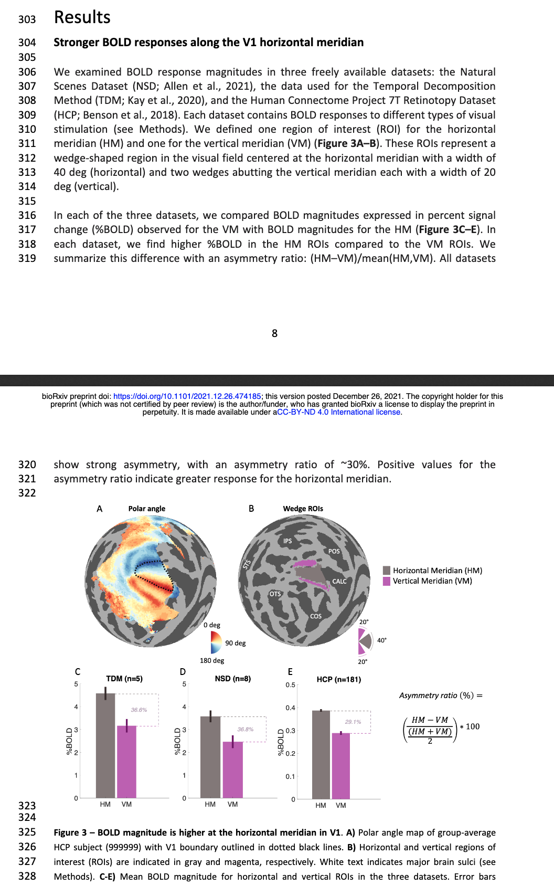
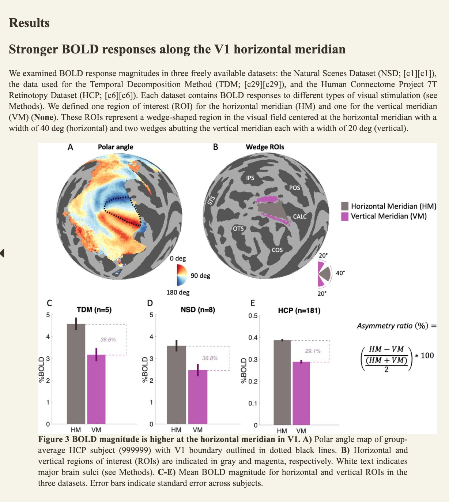

# biorxiv2epub
Convert biorxiv or medrxiv articles to epubs for on-the-go reading. This is accomplished by parsing through the JATS XML source provided by biorxiv, converting this to a markdown document, and then using pandoc to convert to epub. Currently will produce readbly formatted texts, but does not handle references.


PDF             |  EPUB
:-------------------------:|:-------------------------:
 | 
## Requirements
- pandoc

## Usage
```
python biorxiv2epub.py https://www.biorxiv.org/content/10.1101/2021.12.26.474185v1
```

TODO:
- Support multi-graphic figures
